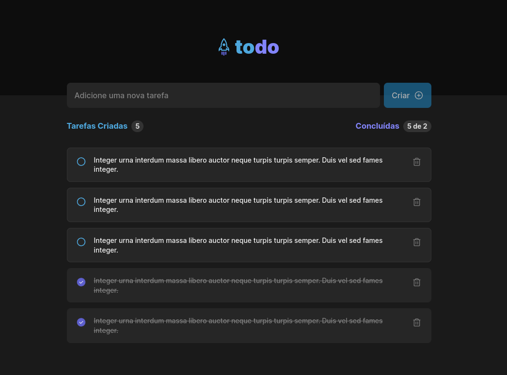

# Ignite Todo

### Stay organized and conquer your day with this efficient to-do list app!



## Project Purpose

This project is a challenge from the [React Rocketseat Course](https://www.rocketseat.com.br/formacao/react).

## Features

- Persistent storage (local storage)
- Mobile and desktop responsive.
- Finished tasks counter.

## Getting Started

You can use it [here](https://pedroclerici.github.io/ignite-challenge-reactjs-todo).
Or you can clone it to your machine.

```bash
git clone https://github.com/PedroClerici/ignite-challenge-reactjs-todo.git
```

Install dependencies with `npm`.

```bash
npm install
```

Run a development preview.

```bash
npm run dev
```

## Credits

Thanks to [Millena Martins](https://www.linkedin.com/in/millenakmartins/) for the [Design](https://www.figma.com/file/0n0zDN7zbzhRbaEO74Xesx/ToDo-List-%E2%80%A2-Desafio-React).
